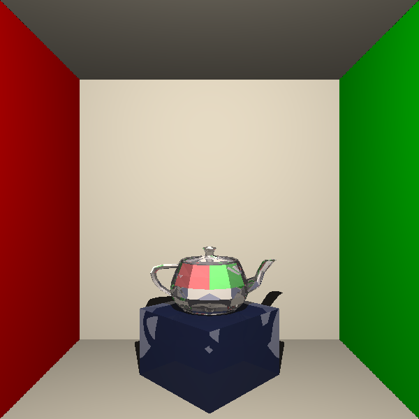
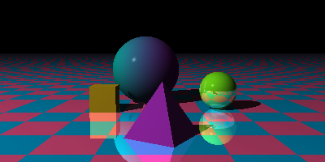

# Tracer of the ray variety

Funny little raytracer to learn more about computer graphics, c++, and cuda.

*Funny little teapot except it has some funny little artifacts :(*

## TODO

- [x] other primitives (cubes, cylinders, cones)
- [x] triangles
- [x] OBJ file support
- [ ] soft shadows
- [ ] area lights, spotlights
- [ ] CUDA support
- [ ] post processing (focal blur, motion blur, AA)
- [ ] texture maps
- [ ] funny normal stuff

## TODO eventually
- [ ] bounding boxes + other opimization
- [ ] subsurface scattering
- [ ] PBR
- [ ] volumetric lighting
- [ ] caustics
- [ ] global illumination
- [ ] denoising
- [ ] CSG 
- [ ] real time support (opengl)
